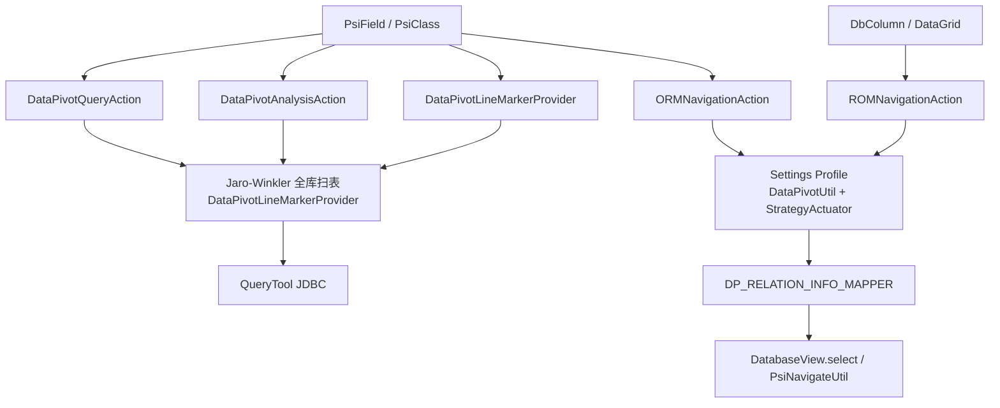
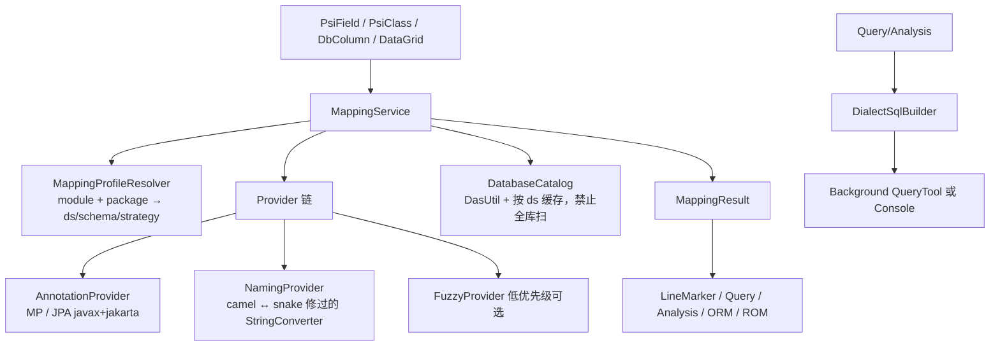

# data-pivot 后续路线图（基于 `cursor/ux-redesign-ui-tests-36d6` / PR #5）

审计范围：`src/main/java/com/data/pivot/plugin/**`、`src/main/resources/META-INF/plugin.xml`、i18n、`build.gradle.kts`、`.github/workflows/**`、现有测试、`README.md`、`doc/ux-redesign.md`、`doc/design/ORM 映射.md`。对照 `main`：PR #5 已合入，文件内容与该分支一致。

本文只排优先级，不改功能代码。

## 当前优势

- 产品切口清楚：从 **Java 字段** 做表/列导航、样本查询、值分布，而不是再做一个 DataGrip。
- 2.x 基线干净：IDEA 2025.3+ / build 253+，复用 Database Tools 数据源与驱动，插件体积小。
- PR #5 把 Query / Analysis / Settings 拉到平台组件（`DialogWrapper`、`SearchTextField`、`ToolbarDecorator`、`FormBuilder`），暗色主题、空态、状态栏、i18n、快捷键、无障碍名称可用。
- 查询 LIKE 走 `PreparedStatement`；`QueryRunner` 可注入，UI 测试不连真实库。
- 测试金字塔与 CI 已对齐模板：`unitTest` / `integrationTest` / `ideaUiTest` → `check`；`verifyPluginFast` 不做额外 IDE 下载；Marketplace 走 GitHub Release `published`。

## 现状架构（问题不在分层名字，而在双入口）

包分层本身合理（`actions` / `view` / `tool` / `config` / `entity` / `context` / `model`），但 **Query/Analysis/行标** 与 **ORM/ROM** 解析到的表/列可以不是同一张。Settings 文案声称 Query/Analysis 也走映射，代码不是。

---

## P0 — 现在就该修（正确性 / IDE 卡死 / 与文档不符）

### P0-1 查询/分析/行标 vs ORM/ROM 映射双轨

- **问题**：`DataPivotQueryAction` / `DataGripUtil.getDatabaseQueryConfigByPsiElement` / `DataPivotLineMarkerProvider` 用 Jaro-Winkler（阈值 0.9）扫全部数据源表；`ORMNavigationAction` 走 `DataPivotApplication.ormMapping` → `DataPivotStrategyActuator`（JPA / MyBatis-Plus / HumpUnderline + Settings）。`DataPivotMappingSettingView` 帮助文案写 Query/Analysis 依赖该映射，实际不读。
- **为何重要**：有 `@TableName("sys_user")` 的 `User` 可能被行标/Query 跳到另一张相似表；用户配了 Settings 仍觉得「映射没生效」。这是产品核心承诺。
- **做法**：短期让 Query/Analysis **优先走与 ORM 同一套** `DataPivotStrategyActuator`（有 Settings 时），模糊匹配降为无配置兜底并标 AMBIGUOUS。中期按 `doc/design/ORM 映射.md` 抽 `MappingService`。先改 Settings 文案，避免继续误导。
- **工作量**：短期 M；完整 MappingService L
- **风险**：改 Query 解析会改变现有「只靠类名相似度」用户的行为，需要 changelog 与空配置回退。

### P0-2 JDBC 跑在 EDT / Swing 线程

- **问题**：
  - `QueryTableComponent.getInstance` 在对话框 `show()` 前同步 `queryRunner.query`
  - 远程搜索 `Alarm.ThreadToUse.SWING_THREAD` 里直接查库
  - `DataPivotAnalysisAction.action` 同步 `QueryTool.query` 再 `show()`
  - `QueryTool.query` 失败时 `Messages.showErrorDialog`（必须在 EDT，但会叠在查询路径上）
- **为何重要**：5s `QUERY_TIMEOUT` × 连接校验会冻编辑器；这是插件体感第一差评。
- **做法**：`ProgressManager` + 后台任务；UI 先出「正在查询」；取消/超时走 Notification，不要再叠模态框。`QueryRunner` 保持可测。
- **工作量**：M
- **风险**：要分清 ReadAction / 后台 / EDT 回写表格；UI 测试需改成注入已完成的结果（现状多数已是）。

### P0-3 启动时给每个数据源抢 JDBC 连接

- **问题**：`DataPivotInitializer.runActivity` → `initDataPivotDatabaseInfo` → `DatabaseConnectionMapperTrigger.load()` 对每个非 Mongo 源 `DriverManager.getConnection`（`setLoginTimeout(1)`）。Query 真正用的是 `QueryTool` 自己的池，这条路径是遗留 `DatabaseUtil.executeQuery`。
- **为何重要**：打开项目 = 对所有库打一次连接；失败被吞掉；成功的连接长期放在 `DR_DATABASE_CONNECTION_MAPPER`。大项目启动变慢，也和「按需连接」叙事相反。
- **做法**：删除或停用 `DatabaseConnectionMapperTrigger`；Query 只走 `QueryTool`；dispose 只关 `QueryTool` / `DataSourceDriverUtil`。
- **工作量**：S
- **风险**：确认没有任何调用仍走 `DatabaseUtil.executeQuery`（当前生产 Query/Analysis 已不走）。

### P0-4 Analysis SQL 只有 MySQL 方言

- **问题**：`DataPivotConstants.DEFAULT_SQL_CONTENT` 固定 `LIMIT` + 子查询 `COUNT(*)`。`DataPivotAnalysisAction` 无视 `dbType` 和 Settings 里的 `sqlCode` / `dataPivotCustomSqlInfo`。Oracle / SQL Server 会直接 SQL 失败。`QueryTool.generateSql` 已按方言分支，Analysis 没有。
- **为何重要**：README / Marketplace 描述声称维护 MySQL、PostgreSQL、Oracle、SQL Server。
- **做法**：按 `DBType` 生成分析 SQL（Oracle `FETCH FIRST`/`ROWNUM`，MSSQL `TOP`）；标识符引用；空结果与 SQL 错误进 Analysis 状态栏。Settings 自定义 SQL 要么接上，要么从实体里拿掉。
- **工作量**：M
- **风险**：百分比子查询在超大表上昂贵，需要 LIMIT 分区值数量并在 UI 标明「仅前 N 个值」。

### P0-5 `StringConverter` 驼峰转换是错的（测试还固化了错误）

- **问题**：`toCamelCase` / `toBigCamelCase` 用 `replaceAll("_([a-z])", "$1")`，`hello_world_test` → `helloworldtest` / `Helloworldtest`。`StringConverterTest.camelCaseConvertersKeepCurrentReplacementBehavior` 把错误当契约。`DataPivotStrategyActuator.executeScript` 的 HumpUnderline **ROM** 以及 JPA/MP `defaultMethod` 都走这里。
- **为何重要**：表 `sys_user` / 列 `user_name` 无法反查 `SysUser.userName`。这是 README 默认策略。
- **做法**：按 JS 原稿对捕获组 `toUpperCase`；改测试；补 `user_id`、连续下划线、全大写列名。
- **工作量**：S
- **风险**：几乎全是 bugfix；若有人依赖错误短名，ROM 行为会变正确。

### P0-6 行标全库扫描 + 奇怪的 AccessCount 缓存

- **问题**：`collectSlowLineMarkers` 对每个 `PsiClass` 调 `getTableInfo`：遍历 `DbPsiFacade.getDataSources()` × `DasUtil.getTables`。`AccessCountCache` 命中 5 次后删缓存，等于反复全表扫描。NPE 缓存 TTL=3。
- **为何重要**：多数据源、上千张表时 Daemon 卡顿；和 Settings 里已选的库无关。
- **做法**：先按 Settings 的 data source/database 缩小扫描；缓存按 `PsiClass` 稳定键 + schema 版本失效（监听已有 `RefreshSchemaActionListener`）；禁止「访问 N 次就驱逐」。模糊匹配不要在 gutter 里做，最多 warning-only。
- **工作量**：M
- **风险**：行标变少会被当成回归；应只在「高置信」时画图标。

---

## P1 — 下一个小版本（2.3）应做

### P1-1 收敛成 MappingService（架构债本体）

- **问题**：见 `doc/design/ORM 映射.md`。`DataPivotObject` / `DataPivotRelation` 塞满 PSI + 路径 + strategy；`DP_ORM_SETTING_MAPPER` / `DP_ROM_SETTING_MAPPER` 在 trigger 里构建后，查找仍全表扫 `DP_MAPPING_SETTING_INFO_LIST_CACHE`。
- **做法**：`MappingProfile`（module/package → ds/schema/strategy）+ Provider 链（Annotation → Naming → Fuzzy）+ `MappingResult(EXACT|NAMING|FUZZY|AMBIGUOUS|UNRESOLVED)`。Query/Analysis/Gutter/ORM/ROM 只消费这一个结果。多候选弹 chooser 并写回 Profile。
- **工作量**：L
- **风险**：最大行为变化；没有 fixture 工程（`data-pivot-test-demo` 是空目录）很容易回归。

### P1-2 JPA `jakarta.persistence` + 注解语义

- **问题**：`JPAAnnotation` 只有 `javax.persistence.*`。`@Entity` 无 `name` 时不应当表名；`@Transient` 已声明但未跳过字段。Spring Boot 3 实体会 ORM 失败、行标仍可能模糊命中。
- **做法**：同一 Provider 认 `javax` 与 `jakarta`；`@Table` 优先于 `@Entity`；跳过 Transient。
- **工作量**：S–M

### P1-3 标识符引用、schema 解析、PostgreSQL LIKE

- **问题**：`QueryTool.generateSql` 把表/列名直接拼进 SQL，`user`/`order`/`group` 会炸。`DataGripUtil.loadDatabaseQueryConfig` 用 `parent.toString()` 是否以 `"database"`/`"schema"` 结尾（TODO 仍在），253+ 不稳。PG 默认 `LIKE` 大小写敏感。
- **做法**：按方言 quote；用 DAS parent kind 而不是 `toString`；PG 用 `ILIKE` 或 `LOWER()`。
- **工作量**：M

### P1-4 ROM 从结果栅格启用但执行仍要 `DbColumn`

- **问题**：`ROMNavigationAction.update` 在 `DataGrid` 有格子时 enable；`action` 仍 `PsiElementUtil.getDataPivotRelation` → 必须 `instanceof DbColumn`，再强转 `DbColumnImpl`。Console 菜单可点然后失败。
- **做法**：从 `DataGridUtil` 解析列/表；禁用不完整上下文；去掉 `DbColumnImpl`。
- **工作量**：M

### P1-5 查询/分析不要自己变成迷你 DataGrip

- **问题**：自建连接池、LIMIT 20、复制 JSON。IDEA 已有 Query Console。
- **做法**：增加「在 Database Console 打开」把生成 SQL 送进控制台；自建表只保留「字段上下文样本」。与 `doc/design/Java 代码字段和数据库字段之间的语义桥接.md` 中期建议一致。
- **工作量**：M

### P1-6 质量：补映射/方言测试，不要再固化 bug

- **空洞**：无 `DataPivotLineMarkerProvider` / `DataPivotStrategyActuator` / `PsiElementUtil` / `DataSourceDriverUtil` 测试；无 Analysis SQL 方言测试；无 Database PSI 集成；`ideaUiTest` 只组组件不 `show()`、不走真实 actionPerformed。`StringConverterTest` 锁定错误 ROM。
- **做法**：轻量 PSI fixture（JPA/MP/无注解各一份）；SQL snapshot（四方言 Query + Analysis）；禁止 `Messages`/`HintManager` 在纯逻辑里。可选一份带 Testcontainers 的 nightly，不进 PR 门禁。
- **工作量**：M–L

### P1-7 发布卫生：2.3.0、changelog、身份 URL

- **问题**：`gradle.properties` 仍 `2.2.0`，UX 在 `[Unreleased]`。`pluginRepositoryUrl`、README 安装/Issue 链到 `wl2027/data-pivot-plugin`；CHANGELOG compare 还有 `runtime-pivot`。Marketplace id 仍 `com.github.wl2027.datapivotplugin`。
- **做法**：发 2.3.0 收录 PR #5；统一 GitHub URL；Marketplace 页与 README 限制对齐（Community 是否真有 `com.intellij.database` 要实测）。
- **工作量**：S

### P1-8 平台 API 与诊断

- **问题**：`ServiceManager.getService`、`StartupActivity` 在 253 应换成 `project.getService` / `ProjectActivity`。`plugin.xml` 无 `<notificationGroup>`，`MessageUtil.Notice` 用 `"Data Pivot Messages"`。工程内无 `com.intellij.openapi.diagnostic.Logger`。`qodana.yml` 仍 JDK 17 / 2024.2。
- **做法**：迁 API；注册 notification group；关键路径打日志（映射未命中、驱动未下载、SQL、耗时）。
- **工作量**：S–M

### P1-9 UX 残余（PR #5 之后）

- Query 错误仍是 `QueryTool` 模态框，与「状态栏」设计不一致。
- 远程搜索无取消、无耗时、无「打开控制台」。
- Settings 表头 bundle 仍是 `module` / `package` 英文；`getDisplayName()` 写死英文。
- 无映射时不会引导打开配置（启动提示被注释）。
- 快捷键 Alt+Q/A/R/O 易与系统/其他插件冲突，应在 keymap 可改（已走 action id，文档说明即可）。
- **工作量**：S–M

---

## P2 — 有价值，但应在 P0/P1 之后

| 项 | 说明 | 工作量 |
| --- | --- | --- |
| MyBatis XML / `@Results` | 大量国内项目表名只在 XML | L |
| Kotlin data class / Java record | 行标 `language="JAVA"`，入口只要 `PsiField` | M |
| Spring Data JDBC / jOOQ | 映射 Provider 扩展 | M |
| 自定义报表脚本 UI | 实体已有字段，Analysis 没用；不要先恢复 JS 引擎 | M |
| MariaDB 当作 MySQL | README 写「不保证」，SQL 几乎能跑，声明即可 | S |
| 插件扩展点 `MappingProvider` | 现在 `plugin.xml` 无任何 EP；等内部 Provider 稳定再开放 | M |
| 缩小 hutool-all | 实际用 StrUtil/ListUtil/JSONUtil；可换 core+json 或平台 JSON | S |
| 删死代码 | `HandleFunctionType`、`SubjectType`、`JS_SCRIPT_CODE`、`DataPivotLookupElement`（若确定不做补全）、`StringConverter.main` | S |
| `PropertiesComponent` → `PersistentStateComponent` | 映射 JSON 无 schema 版本 | M |
| `ProjectUtils.getCurrProject()` | 多项目窗口会串；应全程传 `Project` | M |
| 夜间 Plugin Verifier | PR 继续 `verifyPluginFast`；schedule 跑 `runPluginVerifier` | S |
| Dependabot `target-branch: next` | 仓库未必有 `next` | S |
| 文档：Marketplace 英文描述 | README 插件描述中英混杂，Marketplace 截取该段 | S |

---

## 架构建议（目标态）

线程约定：

- `update`：继续 `ActionUpdateThread.BGT`，只看 PSI 类型。
- 映射：`ReadAction` 读 PSI/DAS。
- JDBC：BGT / `Task.Backgroundable`，禁止 EDT。
- UI：`invokeLater` 填表。
- 启动：只加载 Settings + 策略枚举，**不要**连库、不要建全列 `DataPivotRelation` 列表。

ORM 关系缓存改为按 databaseReference 懒加载，而不是 `BaseAnAction.loadDataGridInfo` 第一次点 Analysis/ORM 就 `collectRelations` 全库全列。

---

## 现在不值得做

- **MongoDB / Redis / 非 JDBC 查询**：2.x 已明确不做；IDEA 自己能查。
- **重新打包 JDBC 驱动**：体积与许可证都是退步。
- **完整 Plugin Verifier 作为 PR 门禁**：2.2.0 去掉是对的；磁盘/时间成本高。改为夜间任务。
- **Kotlin UI DSL / 把插件改写成 Kotlin**：Java + JB 组件在 253 够用；混语言收益低。
- **自定义 JS 映射引擎**（Graal/Nashorn）：已为瘦身删除；先用有限命名函数。
- **把 Query 做成可编辑网格、导出 Excel、分页浏览器**：会变成差一截的 DataGrip。
- **支持 Android Studio / DataGrip / 全系列 IDE**：依赖 `com.intellij.java` + `com.intellij.database`，DataGrip 无 Java PSI。
- **Schema drift 检测**（长期护城河）：在 MappingService 稳定和 fixture 矩阵之前做，误报会毁信任。
- **补完 `HandleFunctionType` / `SubjectType` / 空的 `data-pivot-test-demo` 当作产品功能**：先当死代码或测试夹具，不要当功能。

---

## 建议实施顺序

1. P0-5 驼峰 bug、P0-3 去掉启动连库、P0-4 Analysis 方言（小、可测、立即改善「声称支持的库」）。
2. P0-2 JDBC 离 EDT（体感）。
3. P0-1/P0-6：Query/行标改走 Settings + 缩扫描范围（产品正确性）。
4. P1-7 发 2.3.0（把已合入的 UX 与上述修复送上 Marketplace）。
5. P1-1 MappingService + fixture 工程，再谈 XML/Kotlin/扩展点。
